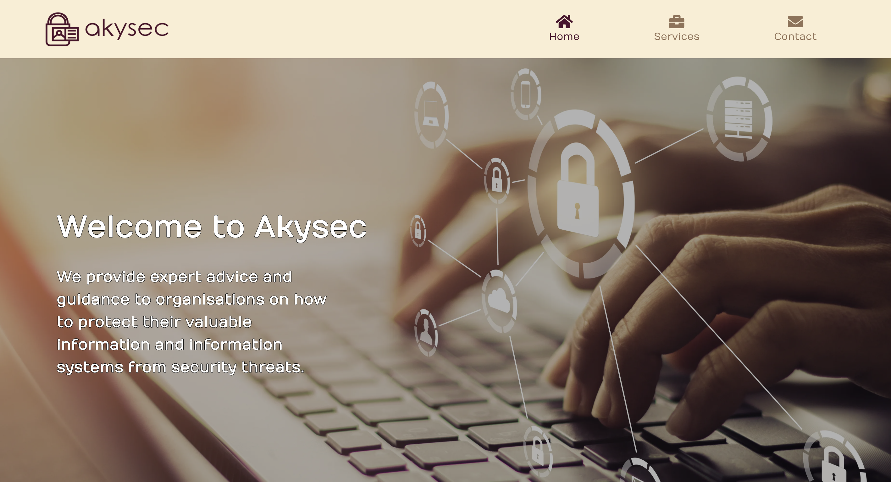

# Akysec

website: https://www.akysec.com

## Introduction
Akysec is an information security company that specialises in providing comprehensive and robust solutions to safeguard information and digital assets. Built with Typescript, React, with content managed by Sanity.io.

# Technologies
Typescript • 
React JS • 
Bootstrap • 
Sanity • 
framer-motion • 
Node JS

# Getting Started
Clone this repository then run the following commands: 
  - npm install
  - npm start

# Author
<h3>Robert Bish</h3>

